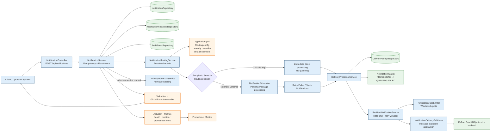
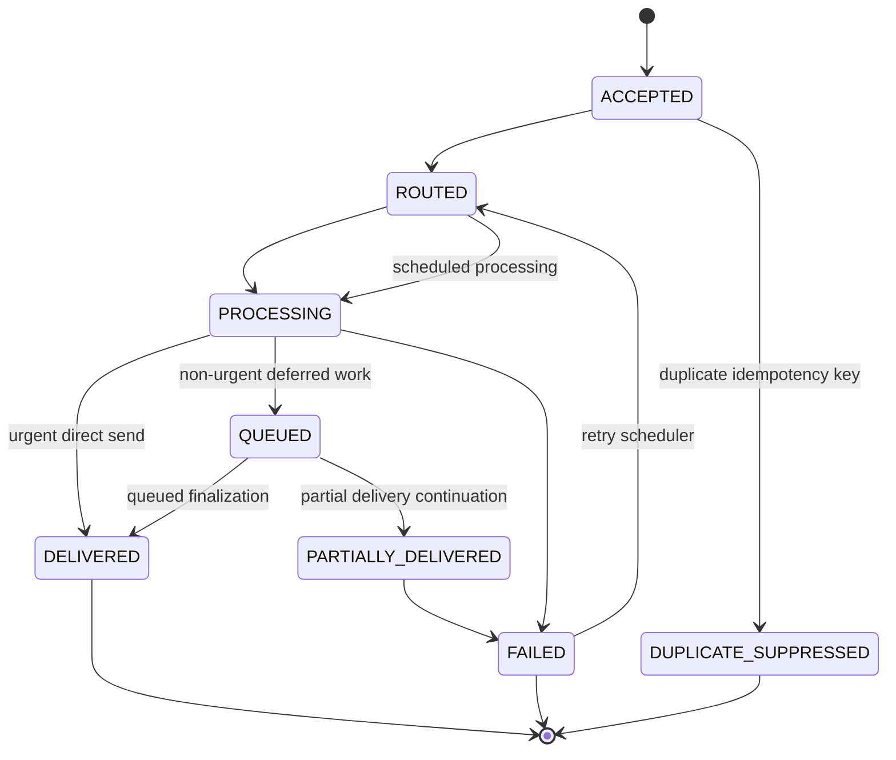

# Notification Service Architecture

## Overview

This diagram shows the end-to-end architecture of the notification service, including API entry points, persistence, routing, delivery, scheduling, and observability layers.

## Component Interaction Details

### API and request handling

The controller accepts a `NotificationRequest` and validates input before handing it to the service. It supports:

- create notification
- fetch notification by ID
- fetch notification by idempotency key
- explicit duplicate rejection through 409 Conflict when the same idempotency key is submitted again

### Ambiguity validation path

The team validates ambiguous requirements by translating them into executable assertions before accepting the implementation. In practice, the service verifies: unique idempotency key behavior, severity-based immediate vs scheduled delivery, and status transitions under both success and retry conditions. These checks are carried in the automated test suite and executed through the Gradle test task.

### Domain and persistence boundary

The core notification aggregate is persisted with its recipients, delivery attempts, and audit events. The database acts as the source of truth for duplicates, retries, and status transitions.

### Routing

Routes are resolved from:

- recipient preferred channels
- configured severity override rules
- default channels in configuration
- fallback defaults in code

### Processing and scheduling

Urgent notifications are processed immediately after the submission transaction commits; this prevents the asynchronous processor from reading or updating an uncommitted notification row. Lower-priority notifications are scheduled for periodic deferred handling. Failed or stuck notifications are retried by a scheduled task.

### Outbound resilience

The delivery layer includes rate limiting and retry loops, protecting the service from overload and transient downstream failure.

### Observability

Actuator and Prometheus metrics provide runtime visibility into health, configuration state, and application behavior.

## Lifecycle State Map

## Recent operational decisions

- persisted-first state is the system-of-record
- queued notifications are finalized by the scheduler rather than by immediate completion in the async processor
- urgent asynchronous dispatch is registered after transaction commit, preventing `ObjectOptimisticLockingFailureException` from concurrent updates of a not-yet-committed notification
- retry and failure states are reconciled through repository queries instead of transient in-memory execution state
- recipient collections are fetched eagerly at the repository boundary to avoid async Hibernate lazy-loading issues
- the global exception handler normalizes API behavior, making the service easier to operate during upstream failures and validation problems

## Greenfield and Brownfield Variants

This service is intentionally designed for both deployment models:

- Greenfield: clean-slate implementation with persistence-first notification ingestion and fully integrated delivery behavior
- Brownfield: same API/service model applied into an existing app with lower risk and compatibility-focused integration

Both variants share the same state model, deduplication contract, retry structure, and runtime observability.
